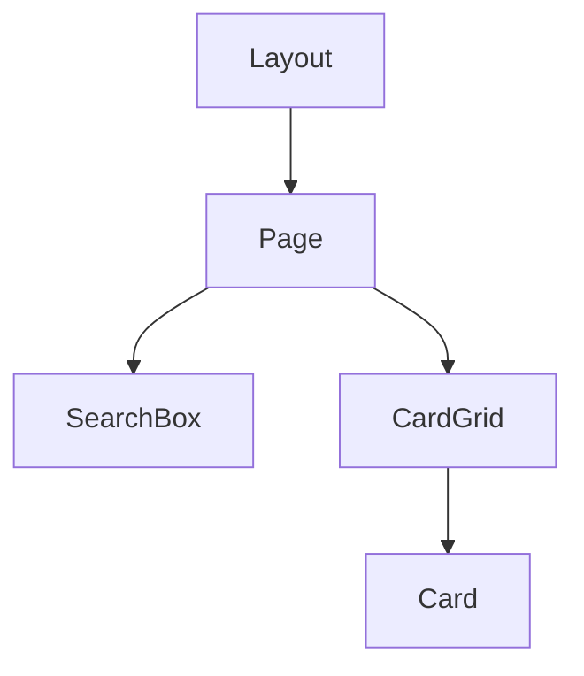

## 🌟 主な機能
- Hugging Face Spacesのプロジェクトをカード形式で表示
- 日本語/英語混在UI対応
- レスポンシブデザイン
- 検索機能（タイトル・説明・タグ）
- Font Awesomeアイコン統合
- ホバーアニメーション付きカード表示

## 🛠️ 技術スタック
- Next.js (App Router)
- Tailwind CSS
- TypeScript
- Font Awesome

## 📦 セットアップ
```bash
git clone https://github.com/your-repository/hf-space-card-showcase-deepseek-r1.git
cd hf-space-card-showcase-deepseek-r1
npm install
```

## 🚀 実行方法
```bash
npm run dev
```

## 📁 画像配置
publicディレクトリに以下を配置：
1. space1.png
2. space2.png 
3. space3.png

## 📝 コミット規約
```
<絵文字> <タイプ> #<Issue番号>: <タイトル>
```

例：
```
✨ feat #123: 検索機能の実装
```

## 🔍 主なコンポーネント


## ✅ 今後の課題
- [ ] タグフィルタリング機能
- [ ] ソート機能の追加
- [ ] ダークモード対応
